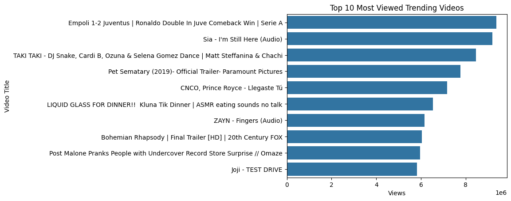
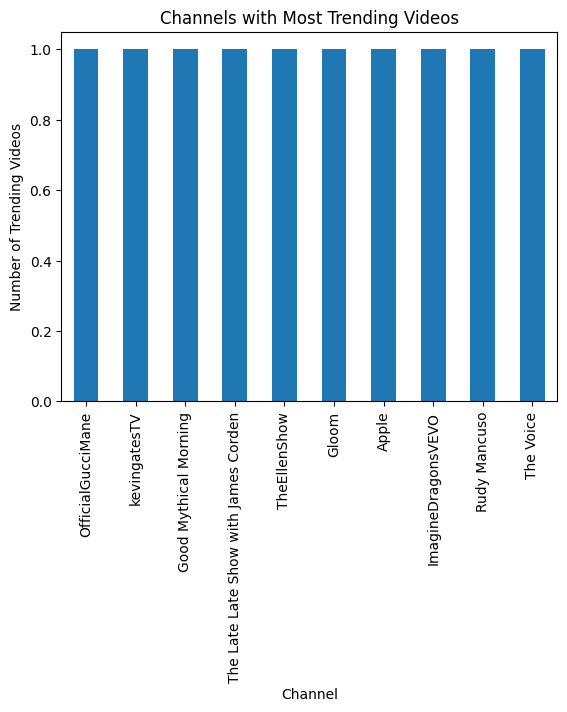
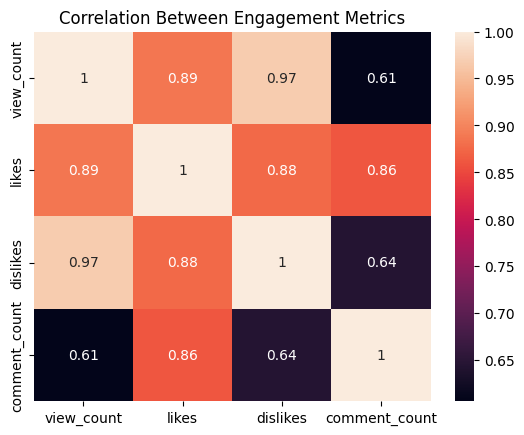
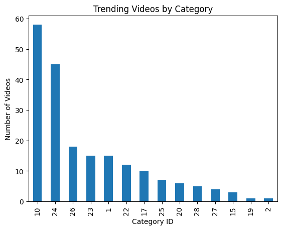
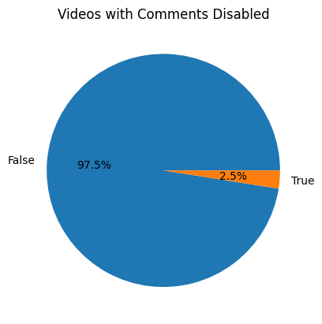
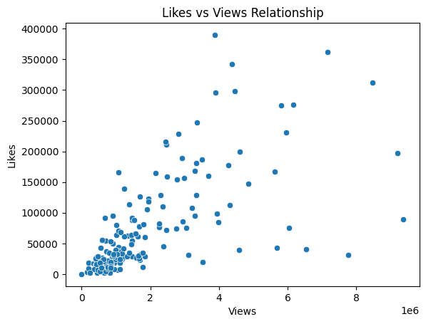

# YouTube Trending Video Analysis

## Project Overview

This project analyzes trending YouTube videos to understand patterns in video popularity, engagement metrics, and content categories. The dataset was cleaned and analyzed using Python to generate insights about trending content.

This project demonstrates:

* Data cleaning
* Exploratory Data Analysis (EDA)
* Data visualization
* Insight extraction

---

# Dataset Description

Dataset used: **US YouTube Trending Videos**

Initial Dataset Size:

* Rows: 200
* Columns: 16

Main features in the dataset:

* video_id – Unique identifier for each video
* title – Video title
* publishedAt – Upload date and time
* channelTitle – Channel name
* categoryId – Category of video
* trending_date – Date video started trending
* view_count – Total views
* likes – Total likes
* dislikes – Total dislikes
* comment_count – Number of comments
* comments_disabled – Whether comments are disabled
* ratings_disabled – Whether ratings are disabled
* description – Video description

---

# Data Cleaning Process

## Handling Missing Values

The dataset contained missing values in the **description column**.

These values were replaced with:

```
No Description
```

This ensured that no null values remained in the dataset.

---

## Duplicate Check

Duplicate records were checked using the `video_id` column.

Result:
No duplicate records were found.

Dataset size remained:
200 rows

---

## Data Type Conversion

To ensure correct analysis, several columns were converted into appropriate formats.

Date Columns Converted:

* publishedAt → datetime
* trending_date → datetime

Numeric Columns Converted:

* view_count
* likes
* dislikes
* comment_count

This step ensured accurate calculations and visualizations.

---

## Outlier Detection and Removal

Outliers were detected using the **Interquartile Range (IQR) method**.

Columns used for outlier detection:

* view_count
* likes
* dislikes
* comment_count

After removing outliers:

Dataset size reduced from:
200 → 162 rows

This improved the reliability of the dataset.

---

# Exploratory Data Analysis

## Top 10 Most Viewed Trending Videos

This graph shows the videos with the highest number of views among trending videos.



---

## Channels With Most Trending Videos

This visualization identifies the channels that appear most frequently in the trending section.



---

## Correlation Between Engagement Metrics

This heatmap shows how engagement metrics relate to each other.

Metrics analyzed:

* Views
* Likes
* Dislikes
* Comments



---

## Trending Videos by Category

This chart shows which categories appear most frequently in trending videos.



---

## Videos With Comments Disabled

This pie chart shows the proportion of videos where comments are disabled.



---

## Relationship Between Likes and Views

This scatter plot shows the relationship between video views and likes.



---

# Key Insights

1. Videos with higher views generally receive more likes and comments.

2. A few channels appear multiple times in trending videos, indicating strong audience engagement.

3. Engagement metrics such as views, likes, and comments are positively correlated.

4. Some video categories trend more frequently than others.

5. Most trending videos allow audience interaction through comments.

6. Removing outliers helped improve the reliability of the analysis.

---

# Conclusion

This project demonstrated how data cleaning and exploratory data analysis can be used to understand patterns in trending YouTube videos. The analysis showed that engagement metrics play an important role in determining video popularity.

The cleaned dataset can be used for further analysis such as:

* Predicting trending videos
* Engagement analysis
* Recommendation systems

---

# Tools Used

* Python
* Pandas
* NumPy
* Matplotlib
* Seaborn
* Jupyter Notebook

---

