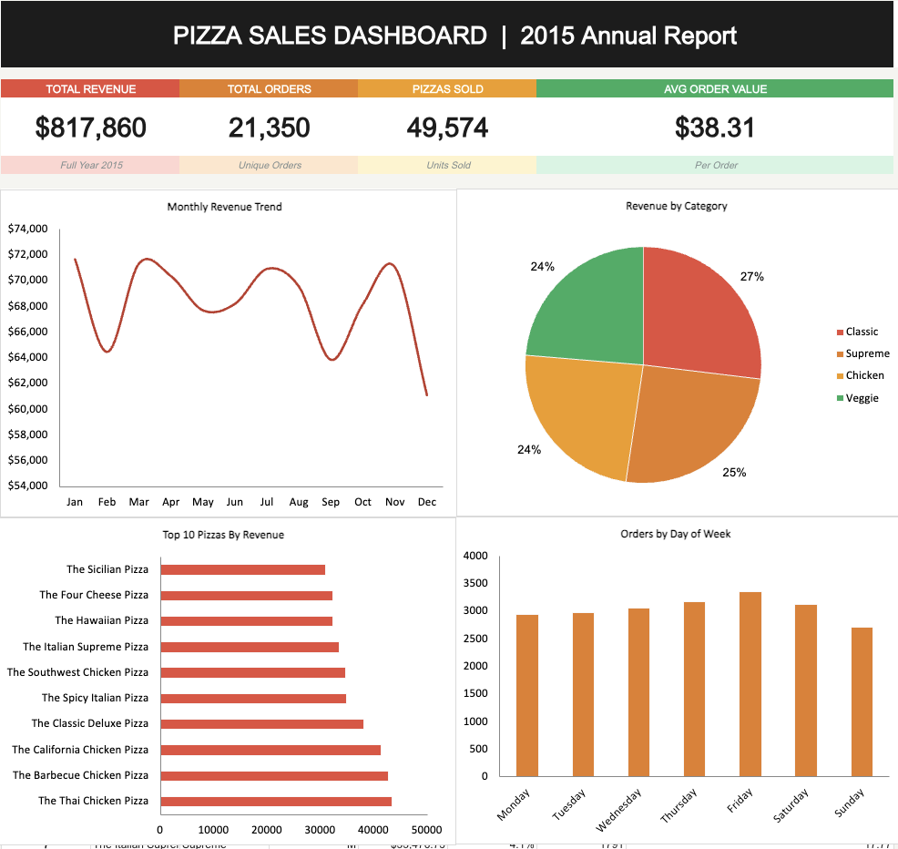

#  Pizza Sales Dashboard

## Overview

An interactive Excel dashboard analyzing annual pizza sales performance for 2015. The dashboard highlights revenue trends, customer ordering behavior, product performance, and sales distribution to support business decision-making.

---

## Dashboard Preview

---

## KPIs

-  Total Revenue
- Total Orders
-  Total Pizzas Sold
-  Average Order Value

---

## Dashboard Features

- Monthly Revenue Trend
- Revenue by Pizza Category
- Top 10 Pizzas by Revenue
- Orders by Day of Week
- Interactive dashboard built using Pivot Tables and Pivot Charts

---

## Tools Used

- Microsoft Excel
- Pivot Tables
- Pivot Charts
- Data Cleaning
- Dashboard Design

---

## Skills Demonstrated

- Business Analytics
- KPI Reporting
- Data Visualization
- Dashboard Development
- Excel Analytics

---

## Key Insights

- Classic pizzas generated the highest share of revenue.
- Friday recorded the highest number of customer orders.
- Revenue remained relatively stable throughout the year with seasonal fluctuations.
- A small group of pizza varieties contributed significantly to total sales.

---

## Files

- Pizza_Sales_Dashboard.xlsx
- pizza_sales_dataset.xlsx
- dashboard_preview.png
